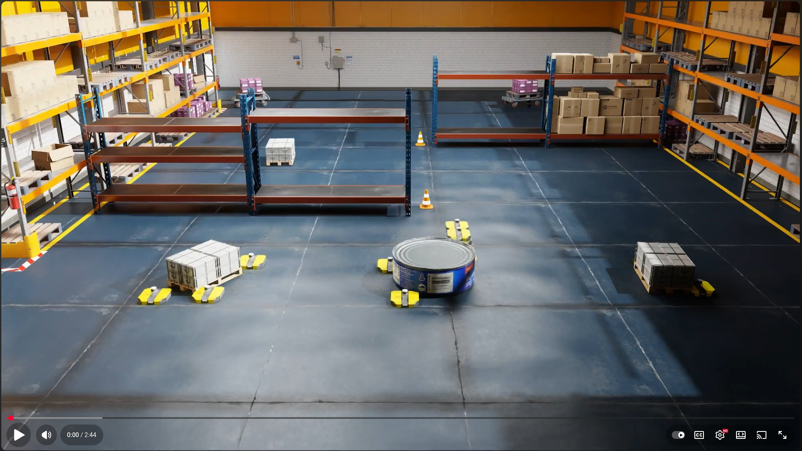

# [Collaborative Multi-Robot Non-Prehensile Manipulation via Flow-Matching Co-Generation](https://gco-paper.github.io)

Welcome to our repository implementing GCo, as presented in:

<table style="border: none;">
<tr>
<td style="vertical-align: middle; border: none;">
  
</td>
<td style="vertical-align: middle; border: none;">
  <i>Shaoul, Y., Chen, Z., Mohamed*, MNG., Pecora, F., Likhachev, M., and Li, J., 2025. <strong>Collaborative Multi-Robot Non-Prehensile Manipulation via Flow-Matching Co-Generation</strong>.</i>
</td>
</tr>
</table>

We are cleaning up the code and will upload it here shortly.
