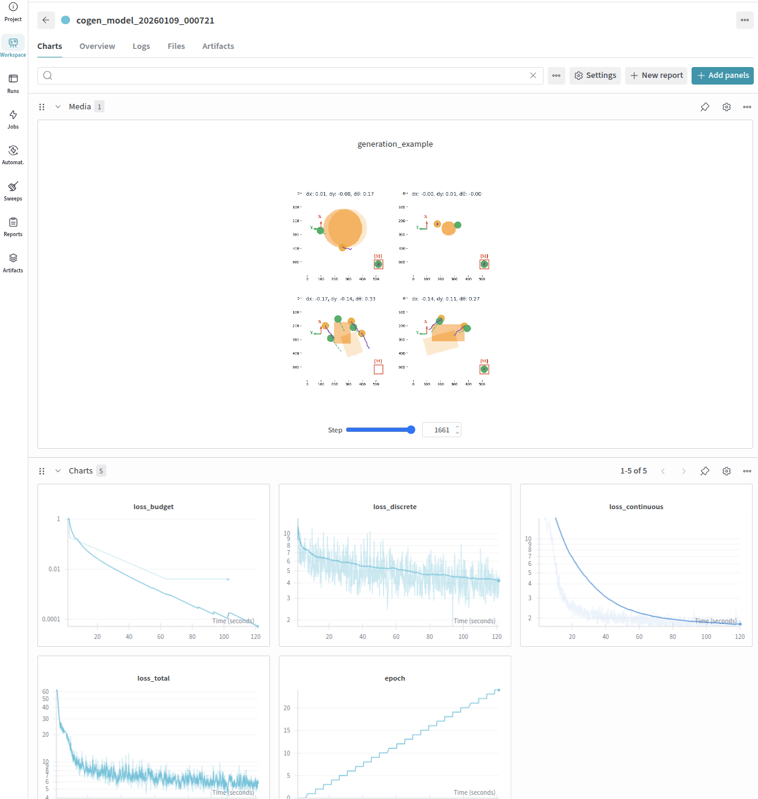
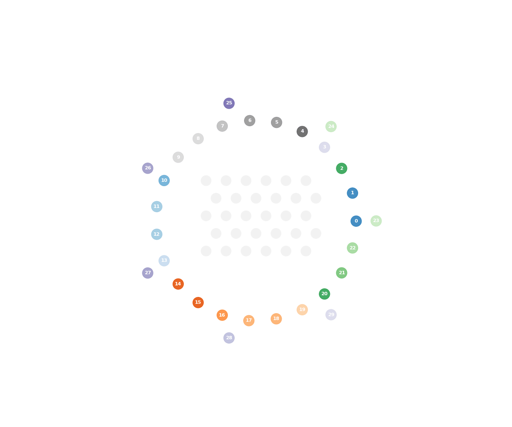

# [Collaborative Multi-Robot Non-Prehensile Manipulation via Flow-Matching Co-Generation](https://gco-paper.github.io)

Welcome to our repository implementing GCo, as presented in:

<table style="border: none;">
<tr>
<td style="vertical-align: middle; border: none;">
  <a href="https://arxiv.org/abs/2511.10874">
    
  </a>
</td>
<td style="vertical-align: middle; border: none;">
  <i>Shaoul, Y., Chen*, Z., Mohamed*, MNG., Pecora, F., Likhachev, M., and Li, J., 2025. <strong>Collaborative Multi-Robot Non-Prehensile Manipulation via Flow-Matching Co-Generation</strong>.</i>
</td>
</tr>
</table>

[](https://www.youtube.com/watch?v=QuaJzqOEhZA)

This document will briefly recap the functionality of the `gco` (Generative Collaboration) package. GCo includes code for (a) a framework for multi-robot manipulation and (b) anonymous multi-robot motion planning. GCo combines learned generative models with classical planning algorithms, and its code is written in Python and in C++.

## Installation

Begin by cloning the repository:

```bash
cd ~
git clone https://github.com/yoraish/gco.git
cd gco
```

Create and activate the conda environment using the provided `gco.yml` file:
```bash
# Create conda environment
conda env create -f gco.yml

# Activate environment
conda activate gco
```

**Install PyTorch:** The conda environment file does not include PyTorch to allow you to install the appropriate version for your system (CPU, CUDA, or MPS).
Visit [PyTorch's official installation guide](https://pytorch.org/get-started/locally/) for the most up-to-date installation commands for your system. We ran this command:

```bash
conda install pytorch==2.0.0 torchvision==0.15.0 torchaudio==2.0.0 pytorch-cuda=11.7 -c pytorch -c nvidia -c defaults
```

**Install the `flow_matching` package:**

```bash
# Install the flow-matching package in editable mode
cd flow_matching
pip install -e .
```
This package is a modified version of the excellent [flow matching](https://github.com/ermongroup/flow-matching) repository. 

**Install GCo package:**

```bash
# Install the gco package in editable mode
cd gco
pip install -e .
```

Verify installation with:
```bash
python -c "import gco; print('GCo installed successfully!')"
python -c "import torch; print(f'PyTorch version: {torch.__version__}')"
python -c "import mujoco; print(f'MuJoCo version: {mujoco.__version__}')"
```

### C++ Bindings

Some planners in `gco` are implemented in C++ for performance and are located in the `gco-cpp/` directory. You'll need to build these and install their Python bindings (the `gcocpp` package).

**Installation Steps:**

```bash
cd gco-cpp

# Build the C++ library
mkdir -p build && cd build
cmake -DCMAKE_BUILD_TYPE=Release ..
make -j$(nproc)  # Uses all available cores; adjust as needed

# Return to gco-cpp directory and install Python bindings
cd ..
./install_bindings.sh
```

Verify installation with:
```bash
python -c "import gcocpp; print('C++ bindings installed successfully!')"
```

**Troubleshooting:**
- If the bindings fail to import, ensure your conda environment is activated

---

## Multi-Robot Manipulation

Let's start by running some examples, and then explore how to create datasets and train models. A convenient entrypoint for multi-robot manipulation is the model evaluation script:

```bash
cd scripts
python run_explicit_model_evaluation.py -v
```
On Mac, you may need to run this command with `mjpython` instead of `python`.

**Troubleshooting:**
- You may want to double check that your `config.py` file correctly points to your dataset model checkpoint. This should be done in the value of `checkpoints.c_r_flex` in `gco/gco/config/config.py`.

If this runs correctly, you should see a visualization window pop up showing the robots manipulating an object towards a goal pose.

<p align="center">
  
</p>

You can customize the evaluation parameters in `scripts/run_explicit_model_evaluation.py`, such as the number of robots, number of trials, obstacle landscapes, starts/goals, etc.

### Data Collection Pipeline

We provide a sample dataset of 20,000 manipulation interactions with rectangles and circles. Use `gdown` to download it (about 30 MB that uncompresses to about 2.7 GB):
```bash
gdown 199sCA4ITLPvIf-Bjfx6BLbDeZFyrZsH3
```

The data collection pipeline generates training data for the contact trajectory models:

```bash
# Create contact push dataset. Samples include object observations, contact points, and push trajectories.
cd scripts
mkdir /tmp/gco_datasets
python create_flexible_robot_dataset.py
```

To configure, see the bottom of the generation script, where you can adjust parameters such as the number of robots and  dataset size, and the configuration file `config.py` where you can set the object shapes under `shape_types` and their size ranges at `shape_size_range`.

Once a dataset is created, you'll find the following files in a temporary directory (which you may need to create when creating a dataset for the first time, if you see a `FileNotFoundError`):
- `contact_trajectory_dataset_datapoints.pkl`: The actual dataset samples
- `visualizations/`: Directory with sample visualizations of the dataset
- `contact_trajectory_dataset_metadata.json`: Metadata about the dataset

**Important:** Upon creation, data is stored in a temporary directory. Move this folder to `data/your-dataset-name/` and update the dataset path in `gco/gco/config/config.py` to point to your new dataset.

### Training Pipeline

Train the contact trajectory models using the continuous-discrete flow matching approach:

```bash
# Train the co-generation model
cd scripts
python train_contact_trajectory_model.py
```

**Optional: Weights & Biases Integration**

The training script supports logging to Weights & Biases for experiment tracking. To enable:

```bash
# Login to wandb (first time only)
wandb login

# Then run training as usual
python train_contact_trajectory_model.py
```

You should see something like this:

<p align="center">
  
</p>

---

## Anonymous Multi-Robot Motion Planning

This section describes GCo's Anonymous Multi-Robot Motion Planning (AMRMP) algorithm GSPI.. For manipulation, we use GSPI at both the object- and robot-levels; producing short object transforms for manipulation, and full-horizon robot paths to reach the contact points generated for manipulating the object.

### Running a Single Planner Example

Navigate to the `gco-cpp/build/examples/` directory. There, you will find a script `planner_example` that can be used to run a single planner.

```bash
cd gco-cpp/build/
./bin/planner_example gspi <task number> <num robots> 

```

For example:

```bash
./bin/planner_example gspi 0 30 # Run the GSPI algorithm on task 0 with 30 robots.
```

You should be able to see the planner running in a visualization window, and once it is closed a GIF will be saved (it takes some time to generate, so I suggest commenting it out in the script if running many times).

<p align="center">
  
  

# Citation

Please cite our paper if you use this code in your research:

```bibtex
@article{shaoul2025collaborative,
  title={Collaborative Multi-Robot Non-Prehensile Manipulation via Flow-Matching Co-Generation},
  author={Shaoul, Yorai and Chen, Zhe and Mohamed, Mohamed Naveed Gul and Pecora, Federico and Likhachev, Maxim and Li, Jiaoyang},
  journal={arXiv preprint arXiv:2511.10874},
  year={2025}
}
```

# Credits and Notes

This repository includes a modified version of the Flow Matching library from Meta (thanks for the awesome work, guys!), licensed under **Creative Commons Attribution-NonCommercial 4.0 International (CC-BY-NC)**. This library provides the foundation for the learned trajectory generation models. 

### System Requirements (i.e., the systems I tested this code on)

- **Operating System**: macOS 15.6 / Ubuntu 20.04
- **C++**: C++17 compatible compiler
- **GPU**: Mac M3 / Nvidia RTX 3080Ti with CUDA 11.3.

